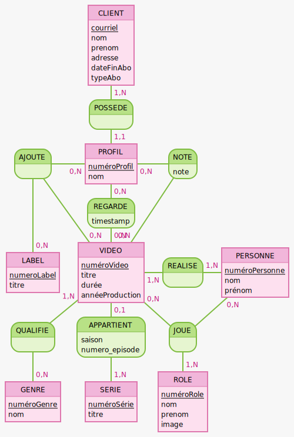

## Synthèse du projet VidéoFlex

### Introduction

VidéoFlex est un projet de base de données qui vise à produire une base de données relationnelle pour la gestion de
vidéos. Le projet a été réalisé en utilisant le langage SQL et a été conçu pour répondre aux besoins spécifiques de la
gestion de vidéos, y compris la gestion des utilisateurs, des vidéos, des catégories et des évaluations.

Pour réaliser ce projet, nous étions 3 : Pierre GUEROULT, Alexandre GUEDES et Jérôme FABRE

### Modèle conceptuel de données (MCD)

Le MCD a été conçu en respectant les exigences qui nous étaient données. Nous avons identifié les entités principales telles que CLIENT, PROFIL, VIDEO, SERIE, LABEL, GENRE, PERSONNE et ROLE. Nous avons également défini les relations entre ces entités, notamment les relations d'association telles que NOTE, REGARDE, AJOUTE, QUALIFIE, REALISE et JOUE.

Le résultat :

### Modèle logique de données (MLD)

Pour ce modèle nous avons traduis le MCD en un MLD relationnel. Nous avons défini les tables principales et les tables d'association, en veillant à respecter les règles de normalisation pour éviter les redondances et les anomalies de données.

On se retrouve à traduire les cardinalités de cette manière :
#### Relations 1,N (Un-à-Plusieurs)

| Relation | Description | Clé étrangère |
|----------|-------------|---------------|
| **CLIENT → PROFIL (1,N)** | Un client peut avoir plusieurs profils | `courriel` placée dans PROFIL |
| **SERIE → VIDEO (0,N)** | Une série peut contenir plusieurs vidéos | `numéroSérie` placée dans VIDEO |

#### Relations N,M (Plusieurs-à-Plusieurs)

Ces relations créent des tables d'association avec les clés primaires des deux entités :

| Relation | Tables liées | Clé primaire composée | Attributs supplémentaires |
|----------|--------------|----------------------|---------------------------|
| **NOTE** | PROFIL ↔ VIDEO | (numéroProfil, numéroVideo) | note |
| **REGARDE** | PROFIL ↔ VIDEO | (numéroProfil, numéroVideo) | timestamp |
| **QUALIFIE** | GENRE ↔ VIDEO | (numéroGenre, numéroVideo) | - |
| **REALISE** | VIDEO ↔ PERSONNE | (numéroVideo, numéroPersonne) | - |

#### Relations N,M,P (Ternaires)

| Relation | Tables liées | Clé primaire composée |
|----------|--------------|----------------------|
| **AJOUTE** | PROFIL ↔ LABEL ↔ VIDEO | (numéroProfil, numéroLabel, numéroVideo) |
| **JOUE** | ROLE ↔ VIDEO ↔ PERSONNE | (numéroRole, numéroVideo, numéroPersonne) |

**Ce qui donne :**

### Tables principales

**CLIENT** (<u>courriel</u>, nom, prenom, adresse, dateFinAbo, typeAbo)

**PROFIL** (<u>numéroProfil</u>, nom, icon,  #courriel)

- FK: courriel REFERENCES CLIENT(courriel)

**VIDEO** (<u>numéroVideo</u>, titre, main_image, durée, annéeProduction, saison, numero_episode, #numéroSérie)

- FK : numéroSérie REFERENCES SERIE(numéroSérie)

**SERIE** (<u>numéroSérie</u>, titre)

**LABEL** (<u>numéroLabel</u>, titre)

**GENRE** (<u>numéroGenre</u>, nom)

**PERSONNE** (<u>numéroPersonne</u>, nom, prénom)

**ROLE** (<u>numéroRole</u>, nom, prenom, image)

---

### Tables d'association

**NOTE** (<u>#numéroProfil, #numéroVideo</u>, note)

- FK: numéroProfil REFERENCES PROFIL(numéroProfil)
- FK: numéroVideo REFERENCES VIDEO(numéroVideo)

**REGARDE** (<u>#numéroProfil, #numéroVideo</u>, timestamp)

- FK: numéroProfil REFERENCES PROFIL(numéroProfil)
- FK: numéroVideo REFERENCES VIDEO(numéroVideo)

**AJOUTE** (<u>#numéroProfil, #numéroLabel, #numéroVideo</u>)

- FK: numéroProfil REFERENCES PROFIL(numéroProfil)
- FK: numéroLabel REFERENCES LABEL(numéroLabel)
- FK: numéroVideo REFERENCES VIDEO(numéroVideo)

**QUALIFIE** (<u>#numéroGenre, #numéroVideo</u>)

- FK: numéroGenre REFERENCES GENRE(numéroGenre)
- FK: numéroVideo REFERENCES VIDEO(numéroVideo)

**REALISE** (<u>#numéroVideo, #numéroPersonne</u>)

- FK: numéroVideo REFERENCES VIDEO(numéroVideo)
- FK: numéroPersonne REFERENCES PERSONNE(numéroPersonne)

**JOUE** (<u>#numéroRole, #numéroVideo, #numéroPersonne</u>)

- FK: numéroRole REFERENCES ROLE(numéroRole)
- FK: numéroVideo REFERENCES VIDEO(numéroVideo)
- FK: numéroPersonne REFERENCES PERSONNE(numéroPersonne)

## Lien vers la maquette 
[Maquette](https://www.figma.com/design/dDP2sdy8HMhhFJKMms3VfY/Videoflex?node-id=0-1&t=8HHaO1ecPmYGuB5p-1)

## Organisation du travail

Nous nous sommes organisés de manière à tous contribuer à chaque tâche sauf pour la maquette.

- **MCD** : Pierre a pris en charge la création du MCD, avec des contributions de Jérôme et Alexandre pour la validation et les ajustements.
- **MLD** : Alexandre a été responsable de la traduction du MCD en MLD, avec des contributions de Pierre et Jérôme pour la validation et les ajustements.
- **Maquette** : Alexandre a pris en charge la création de la maquette avec l'aide de Jérôme et Pierre pour remplir le contenu explicatif de la maquette.
- **Script SQL** : Alexandre a été responsable de la rédaction du script SQL pour créer la base de données et la remplir. Pour ce qui est des scripts fonctionnels, nous avons tous contribué à la rédaction des requêtes SQL pour répondre aux besoins fonctionnels du projet.